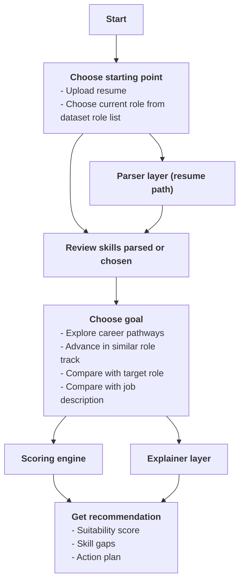

# Casey the Career Auntie - SkillsFuture Career Pathway Recommender

A Telegram-based career planning assistant that turns public SkillsFuture jobs-skills datasets into explainable role recommendations, skill-gap analysis, and practical upskilling action plans.

The product goal is simple: help users understand where they are, where they can go next, why a recommendation was shown, and what they can do to close the gap.

~~A working demo is hosted and can be accessed via the Telegram bot @pycon26_job_skill_finder_bot.~~
Since the hackathon is over, the demo will be stopped but users can spin up their own with the codebase.

## Problem

Public jobs-skills datasets contain rich role, skill, proficiency, and knowledge/ability information, but they are difficult for individuals to use directly.

Users usually do not need a long list of skills. They need:

- a clear view of their current skill profile
- realistic career pathways or target-role comparisons
- a suitability score they can understand
- the specific skills pulling the score up or down
- practical next actions tied to trusted dataset logic

## Product Overview

The MVP uses Telegram as the guided demo surface. Users start from either a resume upload or a dataset role, review their inferred skills, choose a goal, and receive recommendations with explanations.



More detailed diagrams:

- [Simplified user workflow](docs/workflow_diagram_simplified.md)
- [Detailed technical workflow](docs/workflow_diagram.md)

## Workflow Design Choices

The workflow is designed around flexible starting points because different users know themselves in different ways.

Users can start by uploading a resume or by choosing a current dataset role. Resume upload is useful when the user already has work, internship, project, or coursework evidence. Role selection is useful when the user wants a quick baseline without preparing a resume, or when they are exploring from a known current job title.

After the skill profile is parsed or seeded from a role, the user must review, edit, remove, or add skills before scoring. This keeps the recommendation explainable: the score is based on a confirmed skill profile, not a hidden parser judgment.

The goal menu then supports four different career questions:

- Explore pathways: for lateral or adjacent role discovery.
- Advance roles: for users who want to progress in a similar track or sector.
- Search target role: for users with a specific role in mind.
- Paste JD: for users checking readiness for an actual job application.

This design keeps the experience guided but flexible, which matches the hackathon goal: help people navigate upskilling without overwhelming them with raw skill lists.
## Core Features

- Resume upload for `.pdf` and `.docx`
- Current-role search from SkillsFuture dataset roles
- Parsed or role-derived skill profile review
- Skill edit, remove, and add flow before scoring
- Target modes:
  - explore adjacent pathways
  - advance in a similar role or track
  - compare against a specific dataset role
  - compare against a pasted job description
- Deterministic suitability score
- Skill-gap breakdown
- Related-skill explanation layer for overlapping but separately defined skills
- SkillsFuture K&A-backed action plan
- Transient normal report/action-plan attachments and optional debug reports
- Telegram rate limiting for public-demo safety

## How It Works

### 1. Parser Layer

For resumes and job descriptions, the parser layer extracts possible skills and maps them back to SkillsFuture unique skills.

- Rule-based extraction is always available as a fallback.
- Parser agents can be used when configured.
- Parser agents extract evidence, inferred levels, confidence, and reasons.
- Parser agents do not calculate final suitability scores.
- Raw resume/JD text is read at runtime only. Normal Telegram reports and action plans are sent as transient attachments, while debug/local validation artifacts may persist derived evidence for audit.

### 2. User Skill Review

Before scoring, users review the skill profile.

Users can:

- edit a skill level
- remove an incorrect skill
- add a missing SkillsFuture skill

This keeps the user in control and avoids judging them from hidden parser assumptions.

### 3. Deterministic Scoring Engine

The scoring engine uses a sparse skill-vector model and an inferred pathway graph: each skill is a dimension, proficiency is the value, and recommendations are explained through matched skills, gaps, and dataset-backed actions. See the focused [scoring methodology](docs/scoring_methodology.md).


The scoring engine compares the confirmed user skills against a target role or JD-derived requirements.

```text
covered = min(user_level, target_level)
gap = max(target_level - user_level, 0)
suitability = sum(covered) / sum(target_level)
```

MVP assumptions:

- Skills are matched by exact `skill_id`.
- Missing user skills are treated as level `0`.
- Agents can explain or extract evidence, but they cannot change final scores or rankings.

### 4. Explainability Layer

The system explains:

- why the score was given
- which skills matched
- which skills are below target
- which gaps matter most
- which SkillsFuture proficiency/K&A rows support the action plan

There is also an explanation-only related-skill layer. For example, if a user has `Data Analytics and Computational Modelling` but the target role requires `Computational Modelling`, the system can show related evidence while keeping the suitability score based on exact dataset skill definitions.

## Dataset Backbone

The MVP is built on three public jobs-skills dataset files placed under `dataset/`:

- `jobsandskills-skillsfuture-skills-framework-dataset.xlsx`
- `jobsandskills-skillsfuture-tsc-to-unique-skills-mapping.xlsx`
- `jobsandskills-skillsfuture-unique-skills-list.xlsx`

The data pipeline normalizes these into processed tables under `data/processed/`.

Key dataset logic:

- Role profiles map to required skills and proficiency levels.
- TSC/CCS rows provide skill codes and proficiency descriptions.
- K&A rows provide knowledge and ability items for action planning.
- Unique skill mapping gives the product a stable skill dimension.

See [docs/scoring_methodology.md](docs/scoring_methodology.md) for scoring methodology and [docs/project_brief.md](docs/project_brief.md) for broader dataset findings.

## Telegram Demo

BotFather command list:

```text
start - Start career pathway workflow
first_time_user - Explain how the recommender works
start_resume - Start with resume upload
search_roles - Start by searching a role
explain_score - Explain current suitability score
show_gaps - Show current skill gaps
generate_action_plan - Generate action plan report
```

Run locally:

```powershell
.\.venv\Scripts\python.exe scripts\run_telegram_bot.py --drop-pending-updates
```

Run with debug report buttons exposed:

```powershell
.\.venv\Scripts\python.exe scripts\run_telegram_bot.py --drop-pending-updates --debug-mode
```

Required `.env` values:

```text
telegram_api_token=...
```

Optional parser/explainer agent configuration is supported through environment variables. If no agent token is configured or an agent call fails, the system falls back to deterministic/rule-based behavior.

## Operational Safeguards

The Telegram adapter includes process-local per-session rate limiting:

- general interaction limit: 40 actions per 60 seconds
- search limit: 12 searches per 60 seconds
- resume upload cooldown: 60 seconds
- JD scoring cooldown: 30 seconds
- report/action-plan generation cooldown: 15 seconds
- expensive-action locks prevent duplicate concurrent parsing/report jobs
- stale processing locks expire after 180 seconds

This is sufficient for a local hackathon demo. A hosted public deployment should move rate limiting to a shared store such as Redis.

## Setup

Create and activate a virtual environment, then install dependencies:

```powershell
.\.venv\Scripts\python.exe -m pip install -r requirements.txt
```

If the processed data is missing, run the data pipeline validators/generation scripts first. The current repo keeps generated processed artifacts for judge visibility.

## Validation

Useful validation commands:

```powershell
.\.venv\Scripts\python.exe scripts\validate_m1_data.py
.\.venv\Scripts\python.exe scripts\validate_resume_recommender.py
.\.venv\Scripts\python.exe scripts\validate_telegram_adapter.py
.\.venv\Scripts\python.exe scripts\validate_m6_telegram.py
.\.venv\Scripts\python.exe scripts\validate_m7_demo.py
```

Main validation coverage:

- data quality and normalized feature tables
- deterministic scoring
- pathway graph logic
- parser-agent fallback behavior
- resume-first recommender flow
- Telegram adapter and rate limiting
- explainability and action-plan reports
- end-to-end demo readiness

## Judging Criteria Mapping

| Criteria | How this project addresses it |
| --- | --- |
| Process | Roadmap, project brief, daily discussion archives, and human-AI iteration logs document how decisions were made. |
| Data Integrity | The data pipeline normalizes SkillsFuture role-skill-proficiency rows, unique skill mappings, and K&A rows, with validation scripts. |
| User Focus | Telegram guides the user through a small number of choices, requires skill review before scoring, and produces concrete next actions. |
| Technical Execution | Python modules separate data processing, parsing, scoring, pathway planning, explainability, Telegram integration, and validation. |

## Repository Guide

```text
dataset/                 Source Excel datasets
data/processed/          Normalized tables plus curated demo/debug validation artifacts
src/jobs_skills/         Core Python modules
scripts/                 CLI runners and validators
docs/                    Methodology, roadmap, diagrams, judging notes, discussion archives
```

Important docs:

- [Documentation index](docs/README.md)
- [Scoring methodology](docs/scoring_methodology.md)
- [Project brief](docs/project_brief.md)
- [Casey persona guide](docs/casey_persona.md)
- [Roadmap](docs/roadmap.md)
- [Judging package notes](docs/judging_package.md)
- [Telegram live testing guide](docs/telegram_live_testing.md)

## Limitations And Future Work

- Related skills are explanation-only and do not provide scoring credit.
- Parser-agent quality depends on resume/JD evidence quality and can be improved with more examples.
- The current dataset supports K&A-backed learning actions, not official course recommendations.
- Telegram rate limiting is process-local; a multi-instance hosted deployment should use shared rate-limit storage.
- A richer dashboard could help compare pathways visually, but Telegram is intentionally used for MVP scope control.

## Privacy Boundary

- Do not commit `.env` or Telegram tokens.
- Raw resume and JD text should not be persisted.
- Normal Telegram reports and action plans are generated as transient attachments rather than saved locally.
- Normal outputs hide parser confidence, raw evidence snippets, mapping internals, and formulas.
- Debug reports are available for audit trails when explicitly enabled and may persist derived evidence.
