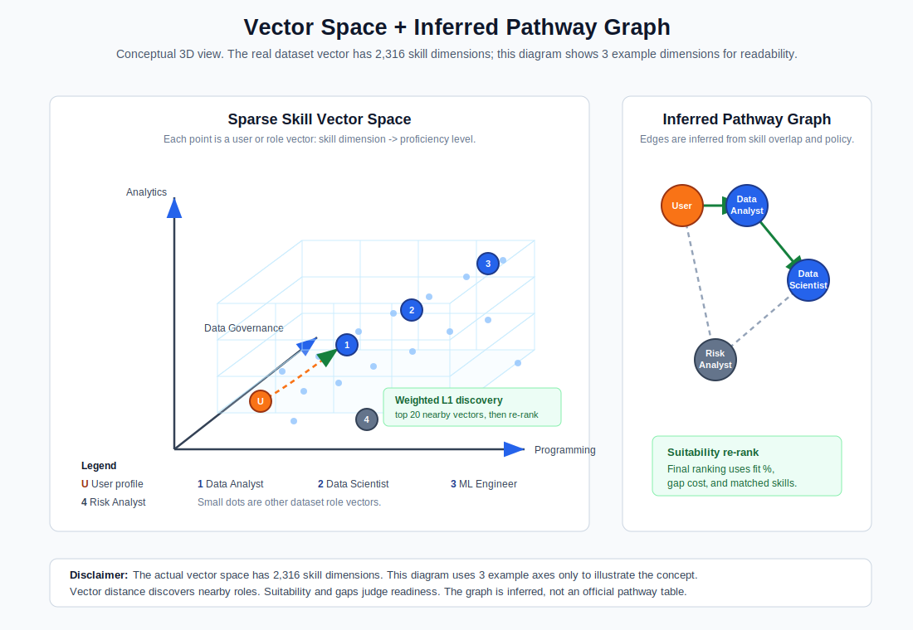
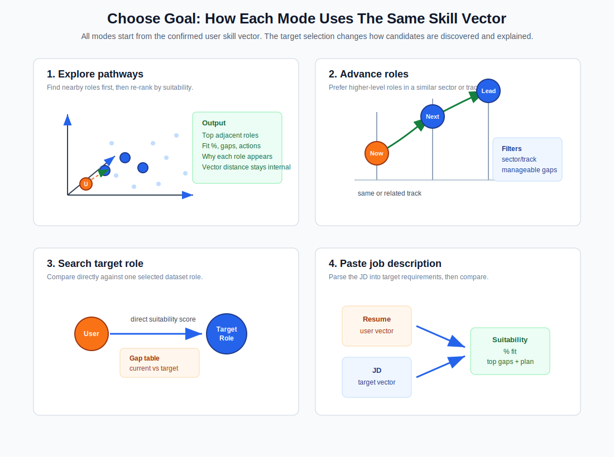

# Scoring Methodology

This document explains how the recommender turns SkillsFuture jobs-skills data into role recommendations, suitability scores, and action plans.

## Core Model

The system represents users and roles as sparse skill-proficiency vectors.

```text
user_vector[skill_id] = assessed proficiency level
role_vector[skill_id] = required proficiency level
```

Each `skill_id` is a normalized SkillsFuture unique skill. The value is the proficiency level for that skill. Most skills are absent from any one user or role, so missing values are treated as level `0`.

The actual vector space currently has 2,316 skill dimensions, based on the normalized unique skills table. The diagram below shows only three example dimensions so the vector-space idea can be understood visually.



## Skill Weights

A skill weight represents how important a skill is for a role. For example, a data role could later mark programming or analytics skills as more important than supporting skills, so those gaps would carry more influence in ranking and action planning.

For this demo, all skill weights are kept at `1.0`. This means every required skill contributes equally unless the dataset itself requires a higher proficiency level. Keeping weights equal makes the MVP easier to explain and avoids pretending that importance tiers are scientifically calibrated before we have a defensible tagging method.

## Suitability Scoring

For a selected target role or parsed job description, scoring is target-aware:

```text
covered = min(user_level, target_level)
gap = max(target_level - user_level, 0)
suitability = sum(skill_weight * covered) / sum(skill_weight * target_level)
gap_cost = sum(skill_weight * gap)
```

This means being above a target level does not reduce the user's score. Being below a required level creates a visible gap that can be converted into an action plan.

The suitability score is used for:

- specific dataset role comparison
- pasted or uploaded job-description comparison
- final judgement after Explore pathway discovery
- action-plan generation from SkillsFuture proficiency and K&A rows

## Explore Pathways

Explore pathways uses a two-stage method.

First, the recommender performs nearest-neighbour discovery over sparse skill vectors using weighted L1 distance. For Explore pathways, the shortlist requires real skill overlap before taking the nearest roles, so unrelated low-requirement roles do not dominate the candidate set:

```text
weighted_l1_distance = sum(skill_weight * abs(user_level - role_level))
```

Missing user or role skill values are treated as level `0`. The system shortlists the top 20 nearest roles by:

```text
vector_distance asc
shared_skill_count desc
role_id asc
```

Second, those 20 candidates are re-ranked with the same target-aware suitability and gap-cost logic used elsewhere:

```text
suitability desc
gap_cost asc
matched_skill_count desc
vector_distance asc
job_role asc
```

Vector distance is therefore used for discovery, not as the final user-facing judgement. The product still explains recommendations with suitability percentage, matched skills, gaps, and dataset-backed action items.

## Goal Mode Diagrams

After the user confirms their skill profile, the product offers four goal modes. They all reuse the same confirmed `user_vector`; the difference is how the target roles or requirements are selected.



- **Explore pathways**: discover nearby role vectors using weighted L1 distance, shortlist candidates, then re-rank by suitability and gap cost.
- **Advance roles**: prefer same or related sector/track transitions where gaps are manageable, then explain the next-step skills.
- **Search target role**: compare directly against one selected dataset role and show current vs target gaps.
- **Paste job description**: parse the JD into target skill requirements, then compare the confirmed resume/profile vector against it.
## Pathway Graph

The pathway graph is inferred from the normalized dataset. It is not an official SkillsFuture career-path table.

Graph nodes include:

- job roles
- sectors
- tracks
- unique skills
- TSC/CCS skill rows
- knowledge and ability items

Role-to-role edges are created when there is enough skill overlap and the transition passes the configured pathway policy. Sector and track are treated as metadata and policy constraints, not skill-vector dimensions.

Pathway fit stays separate from raw skill suitability. This prevents hidden assumptions, such as cross-sector difficulty, from being buried inside a single unexplained score.

## Agent Boundaries

Parser agents and explainer agents are advisory.

- Parser agents may extract skill evidence, infer draft proficiency levels, and suggest skill mappings.
- Users review, edit, remove, and add skills before scoring.
- Explainer agents may summarize why a computed score or pathway makes sense.
- Agents do not calculate final suitability scores, gap costs, or role rankings.

If an agent is unavailable or times out, the system falls back to deterministic rule-based extraction and explanation.

## Explainability Contract

Every recommendation should be explainable from visible inputs:

- confirmed user skills and levels
- target role or JD-derived required skills
- matched skills
- current level vs target level
- top gaps
- SkillsFuture proficiency descriptions
- K&A items used for learning actions

Related-skill notes are explanation-only. For example, `Data Analytics and Computational Modelling` can be shown as related evidence for a `Computational Modelling` gap, but the suitability score still uses exact dataset skill definitions for the MVP.
