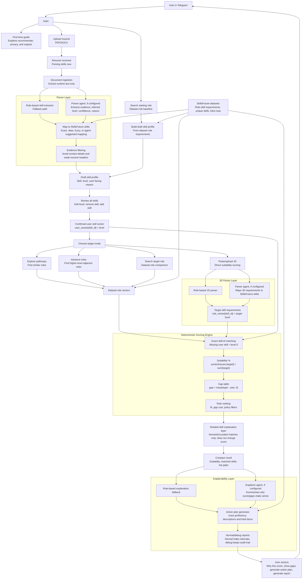

# Jobs-Skills MVP Workflow Diagram

This diagram captures the current resume/role-first workflow, including where parser agents, the deterministic scoring engine, and explainer agents sit in the product flow.

## Key Annotations

- Parser agents are advisory. They extract skills, evidence, inferred levels, and reasons, but they do not calculate final suitability.
- The scoring engine is deterministic. MVP scoring uses exact `skill_id` matching and all skill weights stay at `1.0`.
- The related-skill layer is explanation-only. It can say a confirmed skill is similar to a target gap, but it does not change the suitability percentage.
- Explainer agents are advisory. They summarise parser/scoring outputs for users, while rule-based explanations remain the fallback.
- Raw resume and JD text should be read at runtime only. Normal Telegram reports/action plans are transient attachments; debug/local artifacts may persist reviewed skills, evidence summaries, scores, gaps, and source notes for audit.
