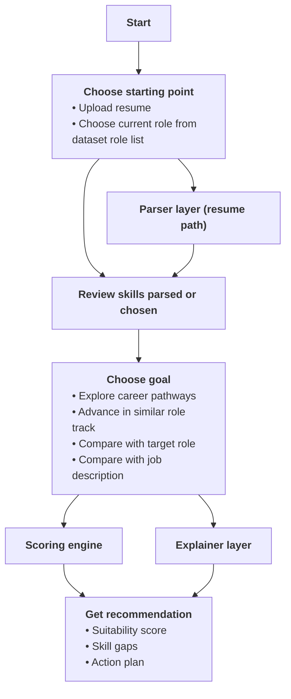

# Minimal Workflow Diagram

This is the simplest version for slides, quick judging walkthroughs, or first-time product explanations.

## Minimal Flow

1. Start.
2. User uploads a resume or chooses their current role.
3. Resume parsing or role selection creates a draft skill profile.
4. User reviews the skills and can edit, remove, or add skills.
5. User chooses a goal.
6. Scoring and explanation layers produce recommendations, skill gaps, and an action plan.
