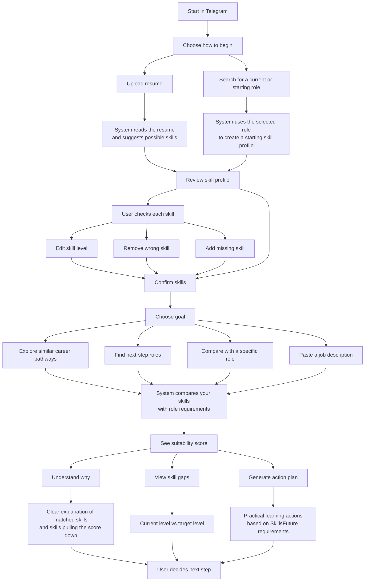

# Simplified User Workflow Diagram

This version explains the recommender flow for non-technical users, judges, and demo viewers.

## Plain-Language Summary

1. The user starts by uploading a resume or choosing a role.
2. The system suggests a skill profile.
3. The user reviews and corrects the skill profile before any scoring happens.
4. The user chooses a career goal, such as exploring pathways or comparing against a job description.
5. The system compares the confirmed skills against role or job requirements.
6. The user receives a suitability score, skill gaps, and a practical action plan.

## What The System Explains

- Why a role or pathway was recommended.
- Which skills matched the target.
- Which skills are missing or below the target level.
- Why similar skills may still count as gaps when SkillsFuture defines them separately.
- What actions the user can take next to close the gaps.

## Important User Promise

The user is not scored directly from hidden assumptions. They can review, edit, remove, and add skills before the system calculates suitability.
